# ABISSO — Enhanced Version

Roguelike multiplayer in tempo reale, senza server, in un unico file.

- 🎬 Video originale: https://www.youtube.com/watch?v=Pxu4IHBrLTU
- 🎮 Gioco originale: https://www.youdev.it/games/abisso.html
- 🚀 Questa versione: https://sanciopanza88.github.io/Abisso-2.0/

## Come si gioca

1. Apri `abisso.html` in un browser moderno.
2. Scegli nome, classe e stanza, poi scendi nell'abisso.
3. Per giocare con altri condividi l'indirizzo (stessa stanza = stesso mondo).

## Miglioramenti rispetto all'originale

- **Grafica**: sprite PNG al posto degli emoji (eroi, mostri, mercante, forzieri), animazioni di attacco, respiro, ombre, ambientazione curata (pavimenti, muri, bagliori).
- **Torce e luci**: le stanze sono illuminate da torce tremolanti, visibili solo nelle zone esplorate.
- **Suoni**: effetti sonori e musiche generate al volo (nessun file audio), pulsante per silenziare.
- **Effetti visivi**: particelle, esplosioni, polvere ai passi, fendenti d'arma, schermo che trema.
- **Boss**: 6 boss unici (Drago Minore, Golem di Pietra, Regina delle Melme, Re Ragno, Re dei Ratti, Lich Signore dei Nonmorti), ciascuno nella propria tana-arena con attacchi dedicati (soffio, cariche, evocazioni, telegrafi di area); il combattimento si scatena entrando nella tana.
- **Nemici nuovi**: cultista, arpia, mantide abissale, cavaliere caduto (con variante alternativa), golem di roccia, sciamano: sprite, attacchi e comportamenti dedicati.
- **Attacchi dedicati**: ogni eroe ha l'animazione d'attacco della propria classe (spada, pugnale, bastone, arco, scudo, bacchetta, mandolino, monache, fucile al plasma) con veloci fendenti ed effetti.
- **Mercante**: nella zona sicura vende pozioni, potenziamenti ed equipaggiamento a sorte.
- **Equipaggiamento**: elmi, armature, anelli e altri oggetti con rarità crescenti (comune, raro, epico, leggendario) e statistiche casuali.
- **Permadeath**: se muori perdi oro, pozioni ed equipaggiamento; prima della fine cadi a terra e un compagno può rianimarti.
- **Minimappa**: mostra mappa esplorata, scale, forzieri, mercante e compagni (tasto M).
- **Frecce ai bordi**: indicano dove sono i compagni fuori schermo.
- **Chat**: testuale con bolle sopra i personaggi e vocale opzionale (microfono).
- **Modalità spettatore**: entra nel mondo come osservatore senza giocare.
- **Flash di danno**: lo schermo si tinge di rosso dal lato da cui arriva il colpo.
- **Multiplayer più affidabile**: connessioni più stabili, e se due mondi si dividono si ricongiungono da soli.
- **Qualità della vita**: barra HP nuova con flash, toast di benvenuto, abilità di classe, pozioni di mana, clic sullo zoom per azzerarlo, pulsanti d'interazione per il touch.

## Eroi giocabili

Le 9 classi dell'abisso, ciascuna con la propria arma, velocità e attacco speciale:

| Classe | Sprite |
|---|---|
| Guerriero | 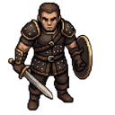 |
| Ladro | 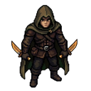 |
| Mago | 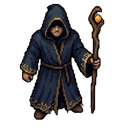 |
| Ranger | 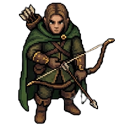 |
| Paladino | 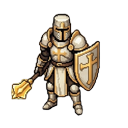 |
| Negromante | 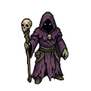 |
| Bardo | 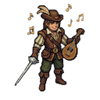 |
| Monaco | 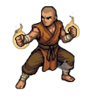 |
| Prof | 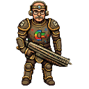 |

## Nemici e boss

Nemici comuni (i primi 6):

| | |
|---|---|
| Cultista | 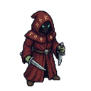 |
| Arpia | 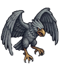 |
| Mantide Abissale | 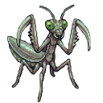 |
| Golem di Roccia | 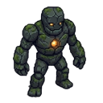 |
| Cavaliere Caduto | 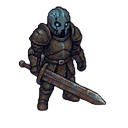 |
| Sciamano | 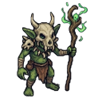 |

I 6 boss delle tane:

| Boss | Sprite |
|---|---|
| Drago Minore | 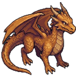 |
| Golem di Pietra | 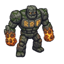 |
| Regina delle Melme | 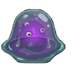 |
| Re Ragno | 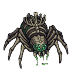 |
| Re dei Ratti | 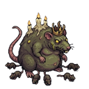 |
| Lich Signore dei Nonmorti | 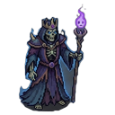 |

## Comandi

| Tasto | Azione |
|---|---|
| `WASD` / frecce | Movimento |
| `Spazio` | Attacco |
| `E` | Interagisci (forziere, scale, mercante, rianima) |
| `Q` | Pozione |
| `R` | Pozione di mana |
| `F` | Abilità di classe |
| `Invio` | Chat |
| `M` | Minimappa |

## Idee scartate / in sospeso

- **Animazioni multi-frame** per zombie e topo: i disegni (frame PNG) sono
  pronti in `assets/anim/`, ma non sono ancora usate nel gioco (il progetto è
  tornato agli sprite singoli). Non tutte le texture presenti nella cartella
  `assets` sono quindi implementate.
- Durante lo sviluppo alcune idee sono state provate e abbandonate (ad esempio
  l'animazione a più fotogrammi dello zombie), per evitare complicazioni.

## Bug

Progetto in evoluzione: il gioco presenterà sicuramente dei bug. Il
multiplayer dipende dalla rete (VPN, relay, firewall) e in condizioni
particolari i giocatori possono non vedersi subito; il gioco cerca comunque di
ricongiungere i mondi da solo. Se trovi un problema, segnalalo aprendo una
issue sul repository.
